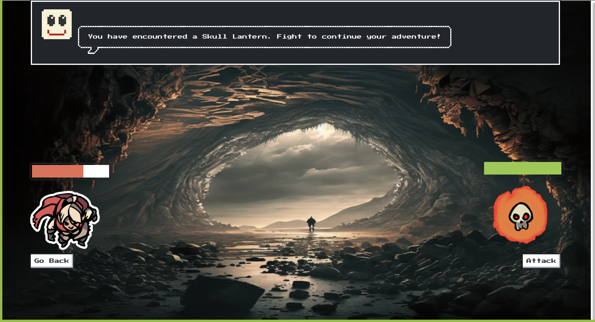

# hero-clash

## Description

This application was made for new prospective DnD players to be able to compare differences between classes and have a basic battle senario.

## Installation

Complete Github git clone process to have local copy of application

## Usage

The title page has an enter button for the user to click to enter class select page for the user.

An image will be generated based off of their class choice and that image will be taken onto the class comparison page. The class comparison page will allow the user to compare their selected class to another class by dragging and dropping the classes available at the top of the screen into the box on the right. 

There is also a fight page where the user class can be visualized.

## Credits

https://github.com/Amartind - Anthony Martindale - Collaborator
https://github.com/jhnwoo-dev - Jason Nguyen - Collaborator
https://github.com/HieuNguyen1905 - Hieu Nguyen - Collaborator
https://github.com/djdevj - Devlin Jenkins - Collaborator 

https://open5e.com/ - API
http://www.dnd5eapi.co/docs/#overview - API
https://2minutetabletop.com/product-category/free/ - Hero Tokens and Monster Tokens
https://www.w3schools.com/html/html5_draganddrop.asp - Html Drag and Drop API
https://nostalgic-css.github.io/NES.css/ - CSS styling
https://luxacss.com/ - CSS layout
